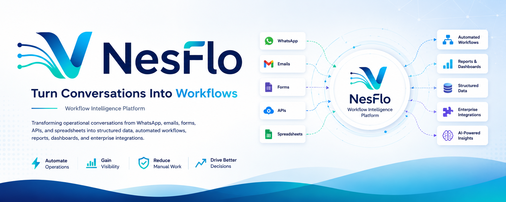

# NesFlo

### Turning Conversations Into Workflows.

A workflow intelligence platform that transforms operational conversations into structured data, automated workflows, reports, dashboards, and enterprise integrations.

---

---

# The Problem

Organizations communicate faster than ever through WhatsApp groups, emails, forms, spreadsheets, and internal communication channels.

However, much of this information still has to be manually:

- Extracted from conversations
- Entered into spreadsheets
- Used to generate reports
- Updated in databases
- Shared via email
- Integrated into business systems

These repetitive processes consume valuable time, introduce human error, and slow operational decision-making.

---

# Our Vision

NesFlo aims to bridge the gap between communication and business systems.

By transforming operational conversations into structured data and intelligent workflows, organizations can automate repetitive processes, improve operational visibility, and make faster, data-driven decisions.

Our vision is to become the operating layer between business communication and enterprise systems.

---

# What We're Building

NesFlo is being designed as a modular workflow intelligence platform capable of transforming data from multiple sources into actionable business operations.

Supported inputs include:

- WhatsApp
- Emails
- Forms
- REST APIs
- Spreadsheets
- Internal business systems

These inputs can then power:

- Automated workflows
- Reports
- Dashboards
- Business intelligence
- Database synchronization
- Enterprise integrations
- AI-powered insights *(planned)*

---

# Technology Stack

### Frontend

- Next.js
- TypeScript
- Tailwind CSS

### Backend

- FastAPI
- Python

### Mobile

- Flutter
- Dart

### Database

- PostgreSQL
- Supabase

### Infrastructure

- Docker
- Redis
- Background Workers
- REST APIs
- Webhooks

---

# Project Status

NesFlo is currently in the **Research & Validation** phase.

Current focus includes:

- Problem validation
- Product architecture
- System design
- Technical research
- Workflow modeling
- API planning
- User experience design

Development of the production platform will begin after the research phase is completed.

---

# Repository Roadmap

This organization will gradually host:

- Backend Services
- Web Dashboard
- Mobile Applications
- Documentation
- SDKs
- Public APIs
- Infrastructure
- Branding Assets
- Examples
- Developer Tools

---

# Contributing

We're always interested in connecting with developers, designers, product thinkers, technical writers, and open-source contributors who are passionate about building scalable SaaS products.

Whether your expertise is in:

- Backend Engineering
- Frontend Development
- Flutter
- UI/UX Design
- DevOps
- AI
- Product Design
- Documentation

your ideas and contributions are welcome.

Please read our **CONTRIBUTING.md** before getting started.

---

# Community Standards

To help maintain a welcoming and professional community, please review:

- CODE_OF_CONDUCT.md
- CONTRIBUTING.md
- SECURITY.md

---

### Engineering the Future of Business Operations.

**NesFlo**

*Turning Conversations Into Workflows.*

